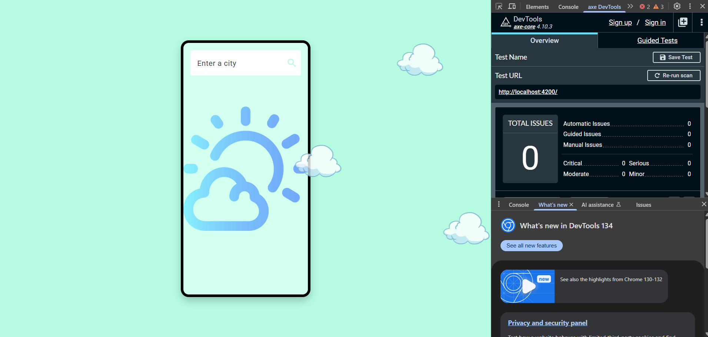
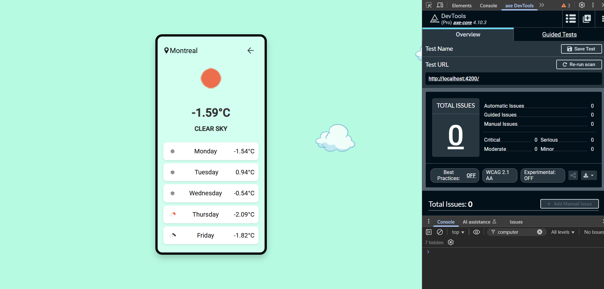

# Mon appli meteo

## Mon appli meteo avec Angular 18
Météo est une application qui permet aux utilisateurs de consulter les prévisions météorologiques en temps réel pour différentes villes. 
Grâce à l'intégration de l'API OpenWeatherMap, elle affiche des informations telles que la température actuelle, la description du temps et les prévisions à venir. 
L'application a été développée en prenant en compte l'accessibilité, en optimisant l'interface pour les personnes en situation de handicap, notamment par l'utilisation d'éléments HTML sémantiques et d'attributs d'accessibilité, garantissant ainsi une navigation fluide pour tous les utilisateurs.

<div align="center">
  
  <br>
  
</div>

## Technologies used 
- **Angular 18**
- **HTML5** 
- **SCSS** 
- **Typescript** 
- **JAVA**
- **SpringBoot**
- **Axe DevTools**
- **Swagger**

## Key Features
- **Rentrer le nom d'une ville: les utilisateurs peuvent rentrer le nom d'une ville afin d'avoir les prédictions méteo sur les cinq prochains jours dans cette ville.**
- **Page resultat: Après avoir rentré le nom de la ville et cliqué sur l'icône de recherche, l'utilisateur peux viualiser les informations méteo.**
- **Bouton retour: En cliquant sur l'icone de retour, l'utilisateur reviens sur la page d'accueil et peut donc rentrer le nom d'une autre villle.**

## Installation and Usage
Node.js(v22.3.0) and npm installed for the frontend.
JDK 15+ for the Spring Boot backend.
An IDE like VSCode or IntelliJ IDEA to edit the code.

From your command line, first clone FevFolio:

```bash
# Clone this repository
$ git clone https://github.com/MumuTach/Weather_app

# Go into the frontEnd repository
$ cd Weather_app/frontend
npm install
ng serve

# Go into the backend repository
$ cd Weather_app/Backend
mvn spring-boot:run

# Open the browser and access the app
http://localhost:4200
```

